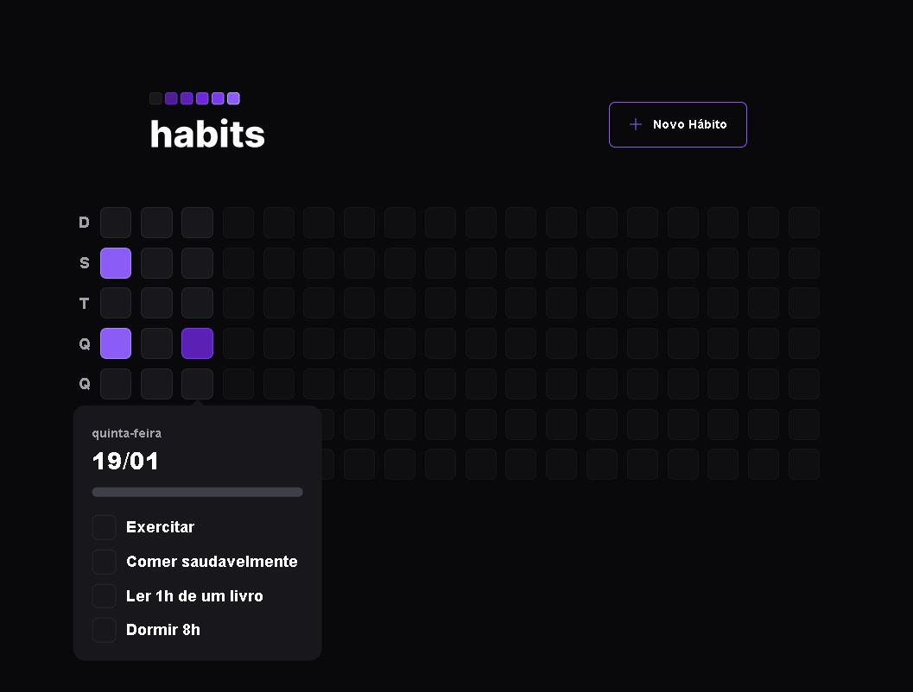
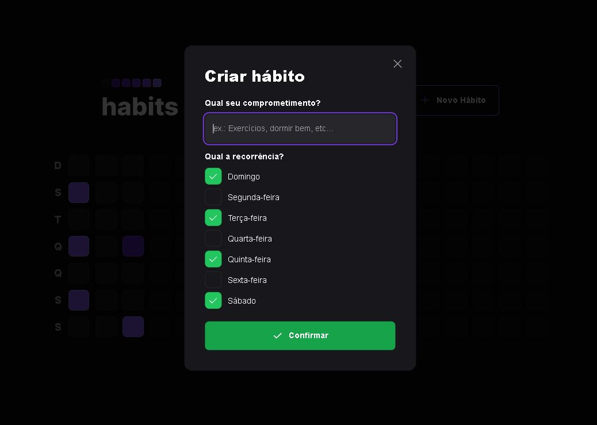
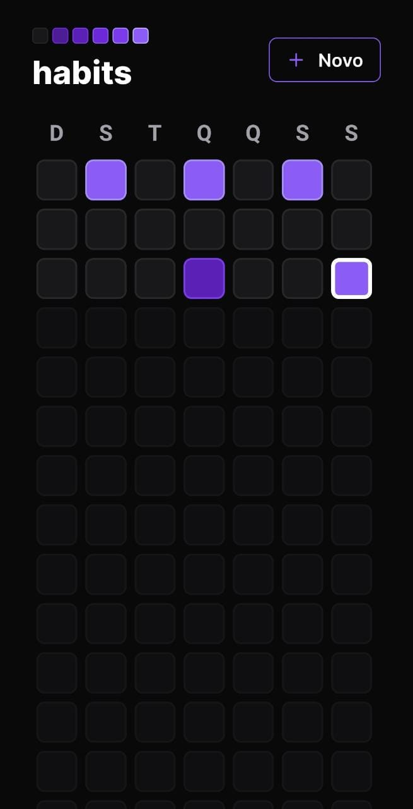
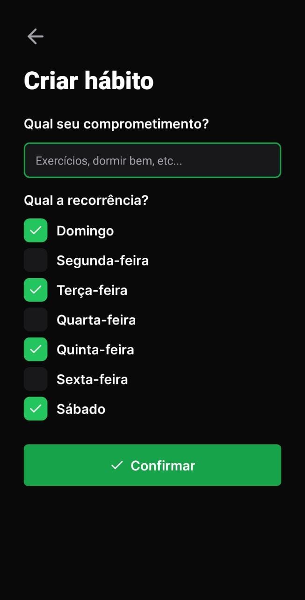
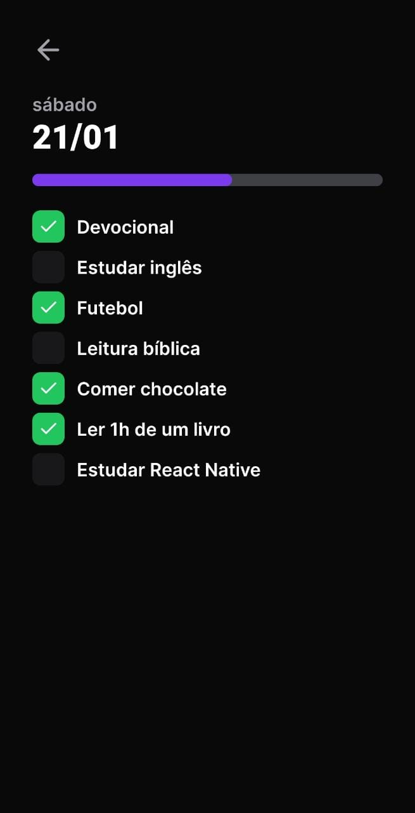

<h1 align="center"> NLW #11 Setup - Ignite </h1>

Evento exclusivo e gratuito realizado do dia 16/01/2023 até 23/01/2023, promovido pela Rocketseat para ensino de tecnologias WEB, Mobile e Back-End.

<a href="#tecnologias">Tecnologias</a>&nbsp;&nbsp;&nbsp;|&nbsp;&nbsp;&nbsp;
<a href="#projeto">Projeto</a>&nbsp;&nbsp;&nbsp;|&nbsp;&nbsp;&nbsp;
<a href="#layout">Layout</a>&nbsp;&nbsp;&nbsp;|&nbsp;&nbsp;&nbsp;
<a href="#memo-licença">Licença</a>

 

Imagem da Home e do popover de controle dos hábitos do dia, da aplicação Web (Imagem 1).

 

Imagem do modal de criação de hábito, da aplicação Web (Imagem 2).

 

Imagem da Home, da aplicação Mobile (Imagem 3).

 

Imagem da tela de criação de hábito, da aplicação Mobile (Imagem 4).

 

Imagem da tela de controle de hábitos do dia, da aplicação Mobile (Imagem 5).

## Tecnologias

Esse projeto foi desenvolvido com as seguintes tecnologias:

- HTML e CSS
- Tailwind
- JavaScript/Typescript
- React
- React Native e Expo
- Prisma
- Git e Github
- Figma

## Projeto

O Habits é um app para ajudar a rastrear os hábitos, com conexão com o back-end. O usuário pode cadastrar um novo hábito, escolhendo os dias da semana em que ele pretende realizá-los, e após o cadastro, é possível fazer o controle de todos os hábitos cadastrados no dia atual, com uma barra de progresso para acompanhamento. Além disso, no menu principal, é possível ver todos os dias, e clicando neles, quais hábitos foram completados ou não.

## Layout

Você pode visualizar o layout do projeto através [DESSE LINK](https://www.figma.com/file/tULzy0B3Pk1IUN4BogJdtb/Habits-(i)-(Community)?node-id=6%3A343&t=djcJaiLDXM99jTq2-0). É necessário ter conta no [Figma](https://figma.com) para acessá-lo.

## :memo: Licença

Esse projeto está sob licença MIT.

---

Projeto realizado pela Rocketseat e feito e adaptado por Victor Pimenta. [LinkedIn](https://www.linkedin.com/in/victor-cardoso-pimenta-0250371a0/)